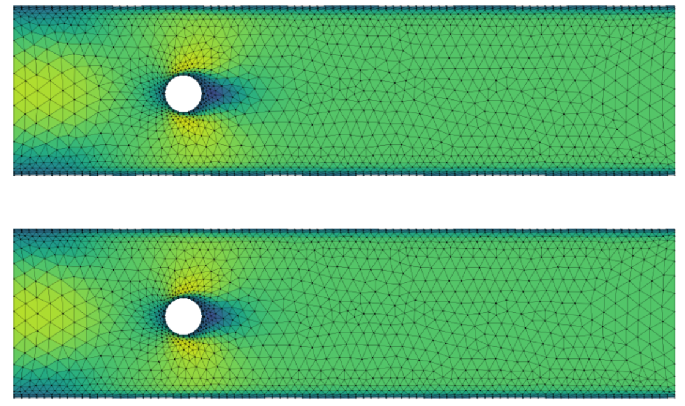

## Task
The goal was to understand how [Graph Neural Networks](../../books.qmd#gnns-books-and-courses) could be used for learning physical dynamics on simulation meshes.

The original motivation was industrial: simulation of thermal expansion during the laser cutting process.
The practical experiment was done on CylinderFlow dataset to understand the MeshGraphNet.

The original data are simulation meshes. For the ML model, mesh is represented as graph:

mesh vertices -> graph nodes
mesh connectivity -> graph edges/adjacency matrix
values on vertices -> node features
relative geometry on vertices -> edge features

The task is one-step forward dynamics prediction:
$G(t)$ -  graph representation of the mesh at timestep $t$
$ΔQ(t) = GNN(G(t))$
$Q(t + 1) = Q(t) + ΔQ(t)$

For CylinderFlow, Q corresponds mainly to the momentum / velocity field on mesh nodes, while pressure is predicted directly as an auxiliary quantity. For the laser-cutting use case, the analogous target would be temperature or thermal expansion.

## Why

Classical [FEM](https://en.wikipedia.org/wiki/Finite_element_method) simulation is accurate, but computationally expensive. The cost grows with mesh resolution and simulation time. New gerometry, boundary conditions usually require re-solving the numerical problem.

The ML question was whether a neural network can learn the physical dynamics from simulation data (act as simulator).

MeshGraphNet is natural fit because FEM meshes are already graph-like.

## 1. Dataset: CylinderFlow

CylinderFlow dataset contains fluid flow around a cylinder on 2D triangular meshes generated in [COMSOL](https://www.comsol.com/video-training/getting-started/building-the-mesh-for-a-model-geometry-in-comsol-multiphysics).

1,200 trajectories
600 timesteps
physical quantities: velocity/momentun and pressure

## 2. Model:MeshGraphNet

MeshGraphNet - a Graph Neural Network follows encode-> process(message passing)-> decode architecture:

*Encoder* : maps node and edge features of the graph into latent embeddings.

*Processor* : performs several rounds of message passing. Neighboring nodes exchange information through graph edges and node/edge embeddings are updated. Aggregate and update node/edge embeddings to learn physical interactions.

*Decoder* : maps final node embeddings to the predicted physical update ($ΔQ(t) = Decoder (H(t))$) on each node.

State update then:
$Q(t + 1) = Q(t) + ΔQ(t)$

## 3. Implementation

I used and studied a public PyTorch Geometric implementation of MeshGraphNet-style model on CylinderFlow dataset from Isaac Ju, Robert Lupoiu and Ryan Kanfar (Stanford CS224W course project).

[Open in Google Colab](https://colab.research.google.com/drive/1mZAWP6k9R0DE5NxPzF8yL2HpIUG3aoDC#scrollTo=5jRZNBna7hPV)

[Here is original MeshGraphNet paper](https://arxiv.org/pdf/2010.03409) from T. Pfaff, Meire Fortunato, Alvaro Sanchez-Gonzalez and Peter W. Battaglia.

## 4. Result

The result was understanding and reproducing the MeshGraphNet-style pipeline for mesh-based physical simulation:

simulation mesh->graph representation (node and edge features)->message passing GNN->next timestep physical update

And clarified how similar approach could be applied to the original use case, where target physical quantity is temperature/thermal expansion instead of velocity/momentum and pressure in CylinderFlow dataset.