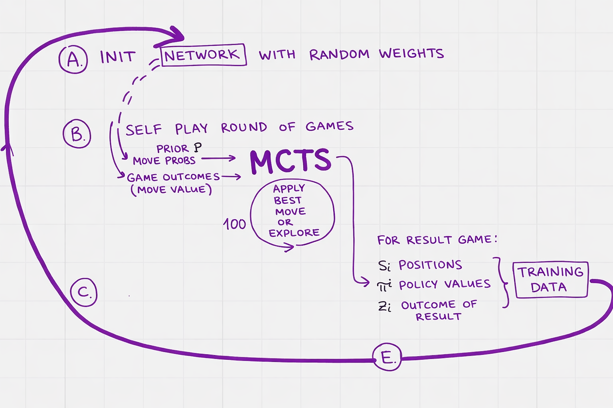

Zero-like reinforcement learning model for chess, similar to the [DeepMind's AlphaZero](https://arxiv.org/pdf/1712.01815) approach.

Practical walktrough to understand the basics of the zero-like reinforcment learning method and [Monte Carlo Tree Search (MCTS)](https://en.wikipedia.org/wiki/Monte_Carlo_tree_search). Which is possible then transfer to you own NP-hard combinatorial optimization problem (like finding the best topologies for industrial network devices).




High-level training loop of the zero-like reinforcement learning pipeline. Thank you Dominik Klein and his book ["Neural Networks for Chess"](https://github.com/asdfjkl/neural_network_chess).

<!--  -->

[Here is full implementation](https://github.com/nikozhuk/neural_network_chess/blob/main/chapter_05/)

Training without input data: in zero-sum self-play game two players play against each other for a bit. The game results compared with the model’s predictions, the network is updated, then self-play again with the updated predictions, then network updated, then self-play, ...
self-learning...



```{=html}

```