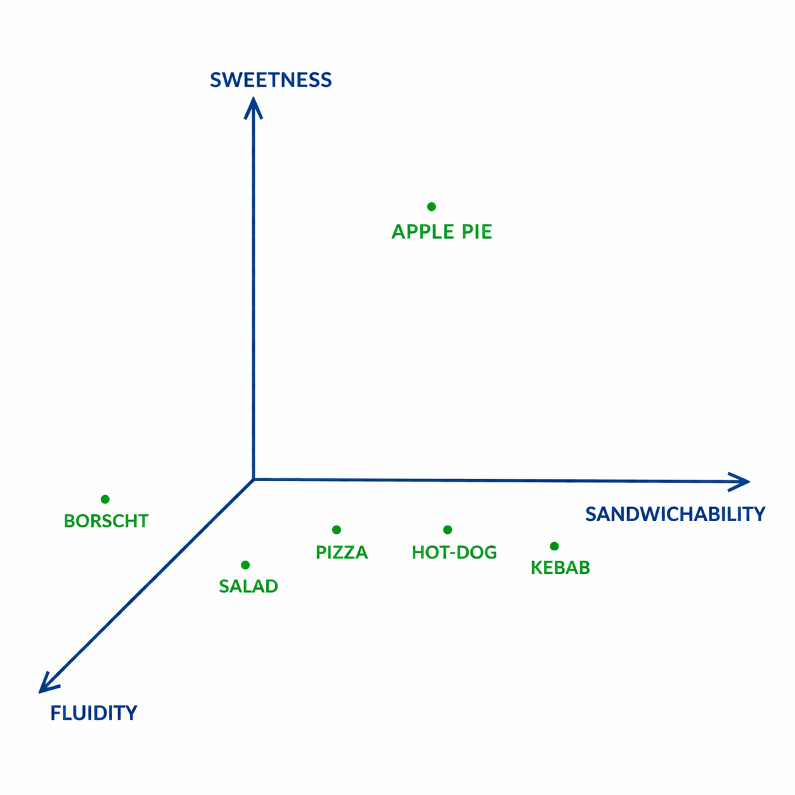

Word2vec explained.

Original paper [T.Mikolov](https://www.linkedin.com/in/tomas-mikolov-59831188/), K.Chen, G.Corrado, J.Dean [Efficient Estimation of Word Representations in Vector Space](https://arxiv.org/pdf/1301.3781)



Thanks to [Jiří Materna](https://x.com/JiriMaterna) for [Machine Learning College in Prague](https://github.com/mlcollege/). Where you can find much more handful notebooks to understand the basics of machine learning.