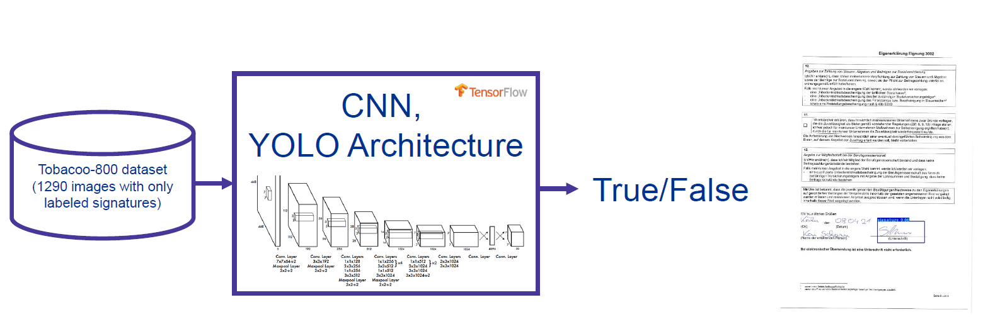

## ML Task
The goal was to automatically detect customer signatures in document images (within a pipeline of AI-based document processing system).

Input - scanned or digital document page, output - decision document signed or not.

Signature in document workflow is important signal that the document confirmed, approved.

## 1. Baseline model: "connected components"

First idea - the signature often forms one of the largest pixel groups on a document, excluding tables and straight lines.

Thus, fast, simple, explainable baseline model was used - ["Connected Components Labeling"](https://homepages.inf.ed.ac.uk/rbf/HIPR2/label.htm) and it's [implementation for signatures](https://homepages.inf.ed.ac.uk/rbf/HIPR2/label.htm). I found the "right" threshold parameter for the given subset of documents.

However the method does not work, fragile for a very "large" signatures, neither for the other types of documents (with tables, stamps, handwritten notes, scan artificats, ...). 

And it also helped to understand the visual structure of the problem before training models.

## 2. Custom CNN

As next, the custom simple classification Inception V3 CNN model was trained. 

On the candidate-regions extraction.

But signatures need also localize, since they appear in different positions and sizes in the documents. Moreover multiple signatures in documents are possible.

### Dataset
At the beginning, there were also no labeled dataset. Therefore the first challenge was to find public available dataset.

Therefore I used [Tobacco800](https://tc11.cvc.uab.es/datasets/Tobacco800_1) document dataset which contains 1290 .TIFF images of scaned real documents with groundtruth annotaions for signatures and logos.

Annotations were reviewed with [LabelImg](https://github.com/HumanSignal/labelImg) and [converted from PASCAL VOC XML annotations format into YOLO .txt format](https://github.com/nikozhuk/signature_detection_YOLOv3/blob/main/1_PASCAL_VOC_to_Yolo_format.ipynb). At the end were around ~ 400 labeled images (275/60/58 -train/val/test) available for training.

## 3. YOLO object detection and transfer learning

The final approach used YOLO - "You Look Only Once" model. Which predicts bounding boxes and confidence scores in one pass.

And was simpler and faster in production.

The choice was also inspirated by [Jordan Bramble's work](https://www.youtube.com/watch?v=ygIDEaPlAJ8).

The [YOLOv3](https://github.com/pythonlessons/TensorFlow-2.x-YOLOv3) detector was trained using transfer learning from pretrained [Darknet backbone weights](https://pjreddie.com/darknet/yolo/) from Joseph Redmon.

Adam optimization, Tiny model, combined localization/objectness(confidence)/classification loss, mAP evaluation with configurable confidence and IoU thresholds.

[Here is full code](https://github.com/nikozhuk/signature_detection_YOLOv3).

## Training and evaluation

Training took several ours on laptop's GPU.

The model achieved **90.07% mAP at IoU 0.5** which were reliably for the task trained on only relatively small public proxy dataset.

However, the result dropped to **37.94% mAP at IoU 0.75** for more precisely match predicted boundig box with ground-truth annotation. The drop suggests that the model usually found the correct signature area, but the bounding boxes were not always tight enough.
