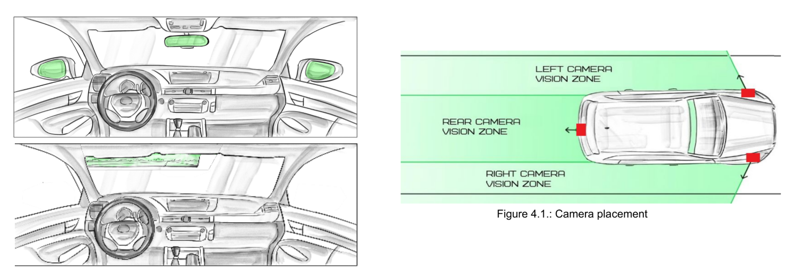
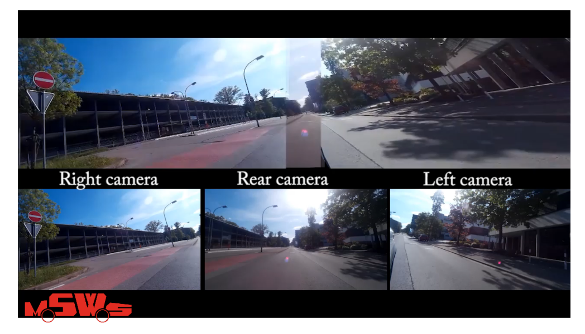

Our team AutoGenZ won 2nd place of Valeo Innovation Challenge 2015. With prototype called Mirrorless Safety Windshield System - computer vision system that replaces traditional car rear and side mirrors with cameras and combined the rear and side views into one panoramicc image, shown inside the car.



